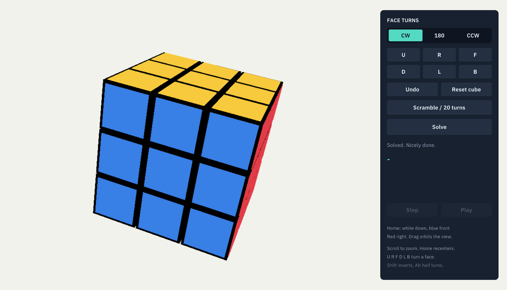

# Rubik

A certified 3×3×3 Rubik’s cube solver.

This repository models all 54 stickers of a 3×3×3 cube and proves two things
about its solver: every solution it returns really solves the cube it was
given, and on a cube a real scramble can produce it always returns one. The
solver follows Kociemba's two-phase method, so its answers are short but not
always shortest, and it solves arbitrary scrambles in seconds.

The proofs build with **Rocq 9.0.0** and the standard library. The native
viewer additionally needs ExtLib, ITree, Paco and the vendored Crane
submodule. Initialize it before building:

```sh
git submodule update --init --recursive
```

```sh
opam exec -- make
opam exec -- make check
```

The build is driven by **dune**: the `Makefile` is a thin set of entry points
over `dune build`. `make` builds the proofs in [theories/](theories), and
`make check` also checks the generated move tables and rechecks the compiled
proofs with `rocqchk`, independently of the build. Python 3 is needed only for
the table check and regeneration. `make install` installs the `Rubik`
namespace.

## Model and moves

A `state` contains six 3×3 sticker grids in the order **Up, Right, Front,
Down, Left, Back**:

```coq
Definition state := (triple grid * triple grid)%type.
Definition grid := triple (triple color).
```

Each grid contains three rows, each with three colors. Rows run top to bottom
and columns left to right when viewing the face from outside. Colors use the
six face names. `init_state` has each face uniformly colored with its own name.
The coordinate convention is specified in [Geometry.v](theories/Geometry.v): +x is
right, +y is up, and +z is front.

A move is a pair `(face, amount)`, where the amount is `CW`, `Half`, or `CCW`.
There are 18 moves. Clockwise is viewed from outside the moving face. All
moves cost one, including half turns: solutions are minimal in the **face-turn
metric**. Centers are fixed; all eight corners and twelve edges move.

`turn m s` applies one move, `run s p` applies a sequence from left to right,
and `inverse m` is the move that undoes `m`.

`valid_state s` means that some sequence of legal moves takes `init_state` to
`s`. This is a reachability definition of physical validity rather than an
algebraic test. The four quantities such a test would use are proved to be
invariant anyway, and the solving method needs all four: corner rotations sum
to zero, edge flips sum to zero, the slice always holds four edges, and the
two rearrangements have even combined parity. Arbitrary sticker assignments
can be represented, but the completeness theorem only requires the validity
predicate. Whole-cube rotations are not moves; the solved center colors fix
the reference frame.

## Modules

Each file below depends only on the ones above it.

| Module | Holds |
| --- | --- |
| [Sticker.v](theories/Sticker.v) | The 54-sticker cube and the six faces. |
| [TurnTables.v](theories/TurnTables.v) | *Generated.* One sticker permutation per turn amount. |
| [BasicRubik.v](theories/BasicRubik.v) | The eighteen moves, sequences of them, and physical validity. |
| [Geometry.v](theories/Geometry.v) | An independent 3D account of a turn, used to check the move tables. |
| [CubieDefs.v](theories/CubieDefs.v) | The 8 corner and 12 edge pieces, their slots, and rotation arithmetic. |
| [CubieTables.v](theories/CubieTables.v) | *Generated.* Which piece a turn moves where, and what colour each slot shows. |
| [Cubie.v](theories/Cubie.v) | The bridge between pieces and stickers, and the projections each coordinate reads. |
| [Subgroup.v](theories/Subgroup.v) | The subgroup the first phase aims at and the ten moves the second may use. |
| [Invariant.v](theories/Invariant.v) | What no move can change, and the cubes that rules out. |
| [Prune.v](theories/Prune.v) | Which moves are worth trying after a given move. |
| [Admissible.v](theories/Admissible.v) | When a distance table is safe to prune with, and how to enumerate a coordinate space. |
| [Tables.v](theories/Tables.v) | Table storage, the breadth-first builder, the six coordinates and their tables. |
| [Phase1.v](theories/Phase1.v) | The search that reaches the subgroup. |
| [Phase2.v](theories/Phase2.v) | The search that finishes inside it. |
| [Solve.v](theories/Solve.v) | The two phases together, and the entry point the viewer calls. |
| [Viewer.v](theories/Viewer.v) | The value-only boundary for the native viewer. |
| [Example.v](theories/Example.v) | Executable regressions and the assumption audit. |

## Using the solver

```coq
From Stdlib Require Import List.
From Rubik Require Import Solve.
Import ListNotations.

Definition scrambled := run init_state [(Right, CW); (Up, CW)].

Eval vm_compute in
  solve_two_phase (build_tables1 tt) (build_tables2 tt) full_bound domino_bound
                  scrambled.
```

`solve_two_phase` follows Kociemba: it first searches with all eighteen moves
for a sequence carrying the cube into the subgroup generated by up and down
turns and half turns of the other four faces, then finishes inside that
subgroup using only those ten moves. `solve_two_phase_sound` proves that any
sequence it returns really solves the cube it was given, and
`solve_two_phase_complete` that it returns one for every cube a real scramble
can produce. Solutions are short but not always shortest.

Each phase is iterative deepening guided by pruning tables, three per phase.
The tables are built by breadth-first search when a solve is requested, and
that search is not proved correct. A heuristic is safe when it reads zero at
every goal and never falls by more than one across a step. Both conditions are
decidable, so a table can be checked rather than proved, and
`consistentb_admissible` turns a passed check into safety. Soundness needs no
such check at all: a wrong table can make the search fail or wander, but it
cannot make it accept a sequence that does not solve. Completeness does need
it, and `tables1_checked` and `tables2_checked` run it.

[Cubie.v](theories/Cubie.v) connects the two views of a cube. The stickers
say where 54 colors sit; the solver works with 8 corner pieces and 12 edge
pieces, each in a slot and rotated within it. `paint_cquarter` proves the two
views agree move for move, and `paint_to_cubies` that they are inverse on any
cube a scramble can produce.

[Group.v](theories/Group.v) reads a cube as the rearrangement that produced
it, so two cubes compose. `crun_element` proves that running a sequence on any
cube is composing that cube with the one the sequence denotes. That is what
makes a solving method checkable: a claim about every cube a sequence might
meet becomes a claim about one cube, which is a computation.

[Parity.v](theories/Parity.v) counts a rearrangement's inversions. A quarter
turn is a four-cycle on the corners and a four-cycle on the edges, so each
parity flips and their combination does not. `cparity_element` rules out a
cube with exactly two pieces exchanged, which is the last thing a solving
method has to know.

[Chain.v](theories/Chain.v) and [Domino.v](theories/Domino.v) run a method
that finishes one slot at a time, reading a table of sequences that leave the
finished slots alone. [Solvable.v](theories/Solvable.v) assembles the two into
`full_solution` and `subgroup_solution`, the bounds the two-phase search needs
in order to answer.

[Prune.v](theories/Prune.v) prunes the move space: consecutive turns of the
same face are never tried, and adjacent opposite faces are kept in one order
only. `normalise` there proves the pruning loses nothing, by rewriting any
sequence into one the pruning keeps that lands in the same place and is no
longer. [Example.v](theories/Example.v) contains executable regressions and
the assumption audit.

## Play it in a browser

The same extracted program is compiled to WebAssembly and served from
[docs/](docs), which GitHub Pages publishes. The cube, the panel and the
solver are identical to the desktop build. Only the loop differs, since the
browser runs it.

```sh
cmake -S . -B build/native -DCMAKE_BUILD_TYPE=Release   # fetches raylib once
opam exec -- make web
```

`make web` compiles raylib for the web from those fetched sources, builds the
extracted program with its `main` renamed aside, and links it against
[web/web_main.cpp](web/web_main.cpp), which hands the extracted `step_frame`
to `requestAnimationFrame` one frame at a time. It writes `docs/rubik.js`,
`docs/rubik.wasm` and `docs/rubik.data`. The page that loads them,
[docs/index.html](docs/index.html), is hand-written and is not generated.

Three things differ in the browser. raylib's web backend has no high-DPI
support, so the page asks for a framebuffer as dense as the display and the
layout is drawn through a matching scale; on the desktop GLFW already does
this and the scale stays at one. Searching runs on the drawing thread,
because worker threads need cross-origin isolation headers that static hosting
does not send, so the tab stops painting while *Solve* works. The
window-close check is answered by the binding header instead of by raylib,
whose own check sleeps for a frame and would need async support compiled in.
The page mentions both.

## Native 3D viewer

The cube is also a raylib application whose every decision lives in Rocq: the
palette, the panel layout, hit testing, the orbit camera, the turn animation,
and the frame loop. [Crane](https://github.com/bloomberg/crane) extracts all of
it to C++, entry point included: the executable is the generated file, and the
only hand-written C++ in the tree is the binding headers it includes.



### How the layers are arranged

[native/RaylibDefs.v](native/RaylibDefs.v) and [native/Raylib.v](native/Raylib.v)
are **generic raylib bindings**. They mention no cube. They declare the handle
and geometry types, the key and button names, and one effect per raylib call,
and they map those effects onto [native/raylib_helpers.h](native/raylib_helpers.h),
a header of thin inline wrappers. Any application could build on them, the same
way Rocqman builds on its separate SDL2 bindings. They live in this repository
only for convenience.

[native/JobDefs.v](native/JobDefs.v) and [native/Job.v](native/Job.v) are a
second, equally generic binding: a **cancellable background job**. `job_start`
runs any pure Rocq function off the calling thread and hands back a handle,
`job_poll` reads its finished value at most once without ever blocking, and
`job_cancel` abandons it. Crane's own `Monads.Par` and `Monads.Thread` do not
fit here, because `future.get` and `join` both block, and an interactive loop
cannot afford either. [native/background_job.hpp](native/background_job.hpp)
implements it with one detached thread and a cell the two sides share.

Solving the cube is just one use of that job. [native/App.v](native/App.v) is
the viewer written against both bindings, running at `raylibE +' jobE`, so
neither binding knows about the other or about a cube.

That leaves the C++ side with nothing to decide. It wraps raylib calls, it runs
a thread, and it parses two command-line arguments. Every pixel position, every
color, every hit test, and every frame of animation is computed by extracted
Rocq, and the function the worker thread runs is named by Rocq too, so the
native side cannot substitute a different solver.

Positions and angles are Rocq reals, which Crane extracts to a `long double`
wrapper, so the rendering layer sits outside the proof trust boundary. The
certified cube results do not depend on it: they go through
[Viewer.v](theories/Viewer.v), whose 54-number boundary is checked with the rest of the
proofs.

`colors_roundtrip` proves that a 54-number snapshot decodes back to the same
state, `solve_request_sound` proves that a reply from the job decodes to a
sequence that really solves that snapshot, and `accepted_solution_solves`
proves that a wrong or stale reply can never be installed as a plan. The
viewer calls the two-phase solver, so its replies are short but not always
shortest; the guarantee holds however the pruning tables came out.

### Typography

The viewer bundles IBM Plex Sans in regular and semibold weights, under the
[SIL Open Font License](assets/fonts/OFL.txt). Fonts are rendered from a
high-resolution atlas with filtered scaling; measurements use the same font
and spacing as drawing. CMake copies them to `assets/fonts/` alongside the
executable, so launching from another working directory works too. Keep that
folder with the binary when moving it.

### Face notation and orientation

The home view uses **white down, blue front, red right** (yellow up,
green back, orange left). `U R F D L B` name positions in that fixed frame;
unprimed moves turn clockwise when looking straight at the selected face.
Dragging orbits the camera without relabelling the cube. Press `Home` to
return to the reference view before following a solution on a physical cube.

### Animation

Every turn is animated. The application hands the frame its own undo history,
compares it against the previous frame's, and reads a single pushed or popped
move as the layer to sweep and the direction to sweep it. It keeps the old
snapshot on screen until the sweep lands, so the picture and the model never
disagree. A turn in progress owns the cube, so commands cannot pile up. Resets
and scrambles change the history by more than one move and are shown at once.

### Building

Crane is a submodule, so clone with it:

```sh
git clone --recurse-submodules https://github.com/joom/rubik.git
git submodule update --init --recursive # if you already cloned without them
```

You need Rocq with `dune`, a C++23 compiler, and CMake 3.24. raylib is fetched
and built automatically when it is not already installed.

```sh
opam exec -- make extract
cmake -S . -B build/native -DCMAKE_BUILD_TYPE=Release
cmake --build build/native -j8
./build/native/rubik
```

`make extract` runs `dune build native/Extract.vo` and copies the result into
`native/generated/`. Crane is a **vendored dune directory**, so the plugin and
its theories are built in place from the submodule and nothing is ever
installed over your opam switch. WebAssembly is not wired up yet.

`RUBIK_SMOKE=shot.png ./build/native/rubik` runs a scripted self-test: the
same extracted loop, driven from a fixed sequence instead of a keyboard. It
scrambles, searches, plays the solution back, and exits non-zero unless it
ended solved and exported the screenshot. The setting arrives through the
environment because extraction gives `main` no arguments.

### Controls

- drag with the mouse to orbit, scroll to zoom, `Home` to recenter
- `U R F D L B` turn a face, with `Shift` for an inverse turn and `Alt` for a
  half turn; the side panel does the same with buttons
- `S` scrambles twenty turns, `X` resets, `Backspace` undoes one turn
- `Enter` starts or cancels the search, `Space` steps one move, `P` plays back

### Finding a solution

“Solve” (or `Enter`) runs the two-phase solver on a snapshot of the cube. The
depth each phase is allowed is the one the proved solving method needs, 372
moves and 200, which is what makes the search provably answer. A real cube is
finished far sooner, at about twelve moves and eighteen, since the deepening
stops at the first depth that works; the limits only decide when the worker
abandons a cube it cannot solve.

On ten random 25-move scrambles the answers ran from 19 to 25 moves, with a
median of 22, and arrived in a second or two; a cube whose first phase runs
deep took half a minute. The worker uses a copied snapshot,
so the view keeps orbiting while it searches. `Enter` cancels a running search;
its result is discarded before it can reach the screen. Cancelling and quitting
abandon the worker rather than waiting for it.

## Proof guarantees

The main results are `solve_two_phase_sound` and
`solve_two_phase_complete`: on a physically valid cube, any sequence the
solver returns reaches the solved cube, and it does return one. Neither takes
a hypothesis. The rest of this section lists what supports them and what
limits them. All proofs are checked by Rocq, with no added axioms, admitted
proofs, or unchecked computation casts.

Completeness rests on knowing that what each phase is asked for is really
there. That comes from a second, much slower solving method, proved outright
in [Solvable.v](theories/Solvable.v): finish one slot at a time, each step
reading a small table of sequences that leave the finished slots alone.
`full_solution` gives a solution of at most 372 moves for any solvable cube,
and `subgroup_solution` one of at most 200 using only the ten moves the second
phase may make. Those are the depths the search is allowed, which is why it
always answers. It is not how long its answers are: the deepening stops at the
first depth that works, which on a real cube is around twenty.

It also rests on the six pruning tables never overestimating, and they are
checked rather than assumed: `tables1_checked` and `tables2_checked` run the
conditions over all 95417 coordinates the tables cover. Table indices are
binary, so a lookup is a walk down the bits rather than arithmetic, which is
what brings those checks within reach of the kernel. Neither theorem below
takes a hypothesis.

### What is not proved

**Anything about length.** No theorem bounds how long an answer is, and none
claims it is as short as possible. The proved bounds of 372 and 200 are about
the slow method, not about what the search returns; measured answers ran 19 to
25 moves. A tuned two-phase solver reaches 20 to 22 by trying several
first-phase sequences and keeping whichever leaves the shorter second phase.
This one takes the first sequence it finds and runs the second phase once, so
its answers are a few moves longer.

The 2×2×2 ancestor this repository grew from proved more about length: its
answers are at most 11 moves. Those proofs work by computing the entire state
graph inside Rocq, which is available for the
3.7 million states of a 2×2×2 with a corner held fixed and not for the
4.3 × 10^19 of a 3×3×3. That gap is the reason for a two-phase solver at all.


| Theorem | Guarantee |
| --- | --- |
| `quarter_geometry` | Every sticker follows a clockwise 3D outer-layer rotation. |
| `quarter_four`, `inverse_undoes` | Four quarter turns are identity; every move has an inverse, which is what the viewer's undo uses. |
| `valid_centers` | Legal sequences preserve the solved centers. |
| `paint_cquarter`, `paint_crun` | Turning the pieces and painting agrees with painting and turning the stickers. |
| `to_cubies_paint`, `paint_to_cubies` | The sticker view and the piece view are inverse on any reachable cube. |
| `twist_total_valid`, `flip_total_valid`, `slice_count_valid` | Corner rotations and edge flips cancel, and the slice always holds four edges; a single twisted corner is therefore unreachable. |
| `phase2_move_keeps_subgroup` | The ten moves the second phase uses never undo the first phase's work. |
| `twists_cturn`, `flips_cturn`, `slice_mask_cturn`, `corner_pieces_cturn`, `ud_pieces_cturn`, `slice_pieces_cturn` | Each coordinate moves on its own, so each can be searched as a space of its own. |
| `consistentb_admissible` | A table that passes its check never overestimates, so pruning with it cannot lose a solution. |
| `tables1_checked`, `tables2_checked` | The six pruning tables pass that check, over all 95417 coordinates they cover. |
| `phase1_sound` | The first phase really reaches the subgroup. |
| `phase2_sound`, `two_phase_sound` | The second phase really solves, and the two together really solve. |
| `solve_two_phase_sound` | Every sequence the solver returns solves the sticker cube it was given. |
| `crun_element` | Running a sequence on any cube is composing that cube with the one the sequence denotes, so a claim about every cube becomes a claim about one. |
| `cparity_element` | The two rearrangements of a reachable cube have even combined parity, so no sequence produces a cube with exactly two pieces exchanged. |
| `full_solution` | Every solvable cube has a solution of at most 372 moves. |
| `subgroup_solution` | Every solvable cube in the subgroup has one of at most 200 using only the ten allowed moves. |
| `normalise_cube`, `normalise_phase2` | Every sequence is matched by one the pruning keeps that is no longer, so pruning throws nothing away. |
| `estimate1_admissible`, `estimate2_admissible` | Checked tables never overestimate, so the depth bound never cuts off a branch that would have worked. |
| `phase1_complete`, `phase2_complete` | Each phase returns whenever a sequence of the allowed length exists. |
| `two_phase_complete`, `solve_two_phase_complete` | The solver answers on every physically valid cube. |
| `colors_roundtrip`, `colors_length` | The viewer's 54-number snapshot preserves every sticker. |
| `solve_snapshot_sound`, `solve_request_sound` | A reply from the background job decodes to a sequence that really solves its snapshot. |
| `solve_snapshot_complete`, `solve_request_complete` | The background job answers on every snapshot a real scramble can produce. |
| `accepted_solution_solves` | A wrong or stale reply is never installed as a playback plan. |

Nothing in the repository is built by a proved procedure: the pruning tables
come from an unproved breadth-first search and the word tables from an
unproved solver. Everything they have to satisfy is checked instead, by
computing, when the modules that hold them compile. That is what makes the
solver affordable to verify, and it is why a wrong table fails to compile
rather than proving anything false. The build prints the assumptions of the
principal theorems; each reports `Closed under the global context`.

Five modules are generated in full and should never be edited by hand:
[TurnTables.v](theories/TurnTables.v) by
[scripts/generate_moves.py](scripts/generate_moves.py),
[CubieTables.v](theories/CubieTables.v) by
[scripts/generate_cubies.py](scripts/generate_cubies.py),
[ParityTables.v](theories/ParityTables.v) by
[scripts/generate_parity.py](scripts/generate_parity.py), and
[ChainTables.v](theories/ChainTables.v) with
[DominoTables.v](theories/DominoTables.v) by
[scripts/generate_chain.py](scripts/generate_chain.py). Run a script to
regenerate its files; `make check-generated` fails if one of the first three
is stale. The last two are self-checking, so they need no staleness test: a
wrong entry fails to compile. No generator is part of the proof trust
boundary.

[scripts/generate_chain.py](scripts/generate_chain.py) finds its sequences by
solving cubes with the extracted solver, through the batch program in
[tools/solve_tool.cpp](tools/solve_tool.cpp). Build it with `cmake --build
build/native --target solve_tool` before running the script. Nothing it prints
is trusted, so the several minutes it takes are a convenience, not part of the
proof.
[Geometry.v](theories/Geometry.v) checks the sticker tables against a separate
geometric specification inside Rocq, and `paint_cquarter` checks the cubie
tables against the sticker tables.

## Source documentation and style

Every Rocq declaration has a one- or two-line Rocqdoc comment explaining its
purpose. The source is organized into small thematic sections, with explicit
public types, consistent proof indentation, and one branch per line for
multiline matches. Generated move tables follow the same style.

```sh
opam exec -- make html       # Browse the coqdoc output it points at
python3 scripts/generate_moves.py --check
```

Keep comments focused on intuition, assumptions, or guarantees. Update the
move generator when changing generated code, then run `make check` to verify
both reproducibility and the proofs.

## Provenance

This began as Laurent Théry's certified 2×2×2 solver. Much of it survives.
The vocabulary is his: `init_state`, `valid_state` and `run` are used here as
they were there, and `turn` is his `m2f` under a plainer name. So is
the shape of the top-level result, that running the returned moves on a valid
state reaches the solved cube, which is what `solve_two_phase_sound` still
says.

The cube and the method have changed. A 2×2×2 has few enough states to settle
by computing its whole graph inside Rocq, which is how his solver gets a total
function and an 11-move bound. A 3×3×3 does not, so the model grew to 54
stickers with a piece model beside it, and the solver became Kociemba's two
phases. [paper.pdf](paper.pdf) describes the 2×2×2 algorithm, not this one.
